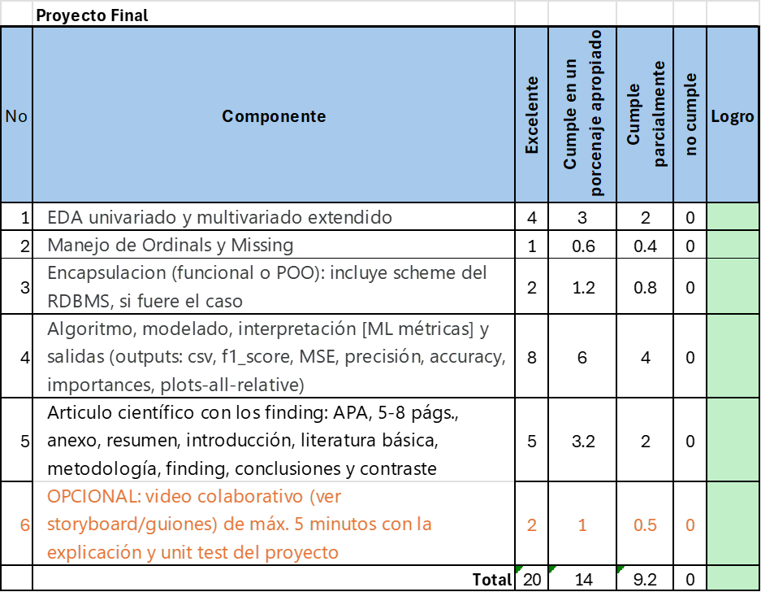

# Pract. 04 - Proyecto Final [COLABORATIVO]: Machine Learning sobre OULAD

## Proyecto Final [COLABORATIVO]

Sobre el dataset **OULAD**, complementado con data anónima de un experimento X (local o internacional). Se deben plantear una o dos hipótesis, así como los algoritmos de ML congruentes con dicho modelo.  
*(En esta sección hay uno del Kongo)*

---

## Entregables

### 1. Artículo científico en formato APA
Debe contener:
- Resumen
- Introducción
- Metodología
- Findings  

**Extensión:** 5–8 páginas APA (contenido) + portada, abstract, tabla de contenido, referencias y anexos.

---

### 2. Proyecto Python en Colab o VS Code de ML

Requisitos:
- Encapsulado con **POO** y uso apropiado de **TAD-collection**.
- Claridad en **OSEMN** (funcional o POO).
- **EDA de alto nivel**:
  - Univariado
  - Bivariado
  - Dispersión
  - Descriptiva
  - Kurtosis
  - Box plot
  - Matriz de confusión
  - Scatter plot
  - Correlacional
  - Otros
- Evidencia del manejo de **missing values**, ordinales y demás ajustes.
- Si se llevó el modelo a un **RDBMS**, comprimir el esquema (`.sql`) para reproducir el escenario.
- Documentación del código:
  - En Colab: texto
  - En VS Code: `# | """ ... """`  
  Debe reflejar el compromiso y colaboración de los integrantes (cómo se dividieron la carga).
- **Modelos predictivos**:
  - Variables dicotómicas (dos estados)
  - Ordinales
  - Intervalo razón  
  Se deben emplear un mínimo de **tres algoritmos supervisados** y opcionalmente determinar tendencias con algoritmos no supervisados.

---

### 3. Salidas esperadas

- Archivos `.csv` con los modelos predictivos a nivel general y caso a caso (`y_test`, `y_pred`).
- Cálculo manual de **f1_score** (TP, FP, TN, FN).
- Métricas relativas a f1_score y MSE:

```python
['precision_macro',
 'recall_macro',
 'f1_macro',
 'accuracy',
 'roc_auc']

results['mse'] = mean_squared_error(y_test, y_pred)
results['r2'] = r2_score(y_test, y_pred)

results['msePI2'] = mean_squared_error(y_research_test, y_research_pred)  # binary targets only
results['r2PI2'] = r2_score(y_research_test, y_research_pred)

```
- Graficos variados: Scatter plot; confusión_matrix

- Identificación de las variables que mas influyen en el modelo: importances


